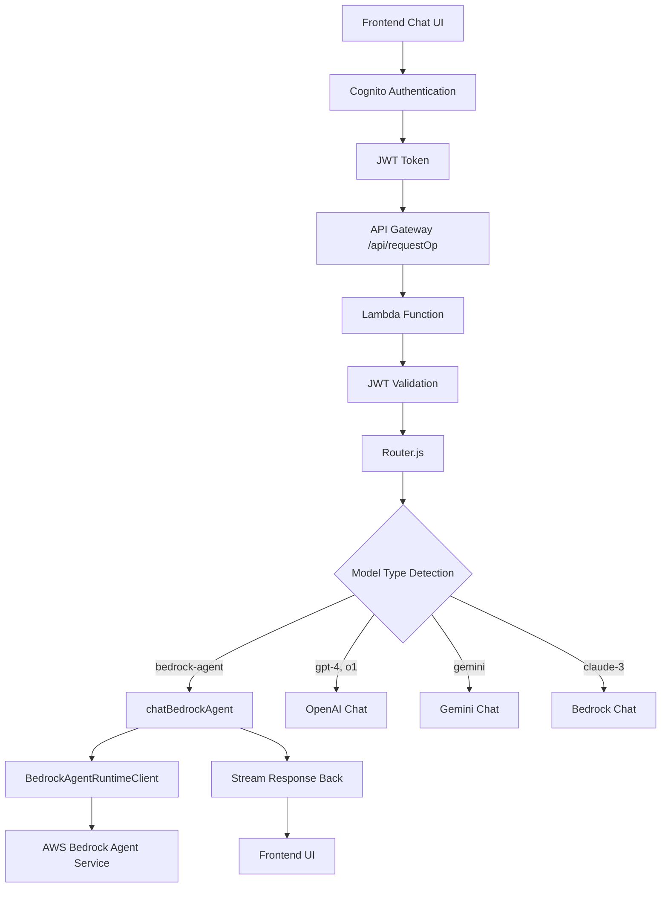

# AWS Bedrock Agent Integration with Cognito JWT Authentication

A comprehensive integration that extends the Amplify GenAI chat system to support AWS Bedrock Agents while maintaining unified Cognito JWT authentication across all AI providers.

## Overview

This integration enables your existing chat application to seamlessly communicate with AWS Bedrock Agents using the same authentication flow and UI interface used for OpenAI, Gemini, and other AI providers. Instead of managing API keys, the system leverages AWS IAM roles and Cognito JWT tokens for secure, scalable authentication.

## Architecture

### High-Level Flow
```
Frontend Chat UI → Cognito JWT → API Gateway → Lambda Function → Model Router → Bedrock Agent
```

### Detailed Architecture Diagram



## Key Features

### 🔐 Unified Authentication
- **Single Sign-On**: Same Cognito JWT authentication for all AI providers
- **No API Key Management**: Leverages AWS IAM roles instead of API keys
- **User Context**: Maintains user identity throughout the conversation flow

### 🎯 Intelligent Routing
- **Automatic Detection**: Routes requests based on model naming conventions
- **Backward Compatibility**: Existing OpenAI, Gemini integrations remain unchanged
- **Flexible Configuration**: Easy to add new model types

### 💬 Session Management
- **Persistent Context**: Bedrock Agents maintain conversation history automatically
- **Consistent Sessions**: Deterministic session IDs based on conversation context
- **Graceful Recovery**: Handles session expiration and renewal

### 🚀 Real-Time Streaming
- **Live Responses**: Real-time streaming compatible with existing UI
- **Resource Management**: Proper stream cleanup and error handling
- **Trace Support**: Optional debugging and monitoring traces

## Technical Implementation

### Model Detection and Routing

The system automatically detects Bedrock Agent requests through model naming:

```javascript
// Model detection logic
export const isBedrockAgentModel = (modelId) => {
    if (!modelId || typeof modelId !== 'string') {
        return false;
    }
    return modelId.startsWith('bedrock-agent-') || 
           modelId.includes('agent') || 
           modelId === 'bedrock-agent';
}
```

**Supported Model Names:**
- `bedrock-agent`
- `bedrock-agent-*` (any suffix)
- Any model ID containing `agent`

### Configuration

Environment variables replace API key management:

```yaml
# serverless.yml
environment:
  BEDROCK_AGENT_ID: "3RAM4VDCCU"
  BEDROCK_AGENT_ALIAS: "ZE8JEFLFIU"  
  BEDROCK_AGENT_REGION: "us-east-1"
```

### Session Management

Unlike stateless OpenAI interactions, Bedrock Agents maintain conversation context:

```javascript
// Consistent session ID generation
export const generateSessionId = (conversationId, requestId) => {
    const baseId = conversationId || requestId || 'default-session';
    const hash = createHash('md5').update(baseId).digest('hex');
    return `session-${hash.substring(0, 16)}`;
};
```

### AWS SDK Integration

Direct AWS SDK usage instead of HTTP API calls:

```javascript
// Initialize Bedrock Agent Runtime Client
const client = new BedrockAgentRuntimeClient({ region });

// Invoke agent with session context
const command = new InvokeAgentCommand({
    agentId: process.env.BEDROCK_AGENT_ID,
    agentAliasId: process.env.BEDROCK_AGENT_ALIAS,
    sessionId: sessionId,
    inputText: userInput,
    enableTrace: process.env.TRACING_ENABLED === 'true'
});

const response = await client.send(command);
```

## Comparison: OpenAI vs Bedrock Agent

| Feature | OpenAI Integration | Bedrock Agent Integration |
|---------|-------------------|---------------------------|
| **Authentication** | API Key in environment | IAM Role + JWT context |
| **Endpoint** | `https://api.openai.com/v1/chat/completions` | AWS SDK `BedrockAgentRuntimeClient` |
| **Model Selection** | Model ID (gpt-4, gpt-3.5-turbo) | Agent ID + Alias ID |
| **Session Management** | Stateless (context in messages) | Session-based with persistent context |
| **Streaming** | Server-Sent Events | AWS SDK async iterators |
| **Configuration** | API key + model name | Environment variables |
| **Rate Limiting** | OpenAI's rate limits | AWS service quotas |
| **Monitoring** | External logging | AWS CloudWatch + X-Ray |
| **Cost Management** | External billing | AWS native billing |

## File Structure

```
amplify-genai-backend/amplify-lambda-js/
├── bedrock/
│   ├── bedrockAgent.js          # Main Bedrock Agent implementation
│   └── bedrock.js               # Regular Bedrock models
├── common/
│   ├── params.js                # Model routing and detection
│   ├── streams.js               # Streaming utilities
│   └── logging.js               # Logging infrastructure
├── tests/
│   ├── bedrock-agent-routing.test.js
│   ├── bedrock-agent-session.test.js
│   ├── bedrock-agent-streaming.test.js
│   ├── bedrock-agent-error-handling.test.js
│   ├── bedrock-agent-logging.test.js
│   ├── bedrock-agent-session-expiration.test.js
│   └── bedrock-agent-model-validation.test.js
├── router.js                    # Main request router
└── serverless.yml              # Configuration and deployment
```

## Security Model

### Authentication Flow
1. **Frontend**: User authenticates via AWS Cognito
2. **JWT Token**: Contains verified user identity
3. **Lambda Validation**: Validates JWT and extracts user context
4. **IAM Authorization**: Lambda execution role authorizes Bedrock Agent access
5. **Agent Invocation**: Secure communication with Bedrock Agent service

### Security Benefits
- **No API Keys**: Eliminates API key rotation and management
- **AWS Native**: Leverages AWS security best practices
- **User Context**: Maintains user identity throughout the flow
- **Audit Trail**: Complete logging and monitoring through CloudWatch

## User Access Control

### New Cognito Users
✅ **Automatic Access**: New Cognito users automatically get access to the chatbot
- **JWT Validation**: System validates Cognito JWT tokens automatically
- **Default Models**: All users get access to Bedrock Agent by default
- **No Additional Setup**: No separate registration process required

### Current Access Model
```
New Cognito User → JWT Token → Lambda Validation → ✅ Access Granted → Bedrock Agent Available
```

**What new users get:**
- Immediate access to chat interface
- Bedrock Agent model availability
- Persistent conversation sessions
- Real-time streaming responses

**Access Control Notes:**
- Currently in "universal access" mode for all valid Cognito users
- Models API returns 403, so system falls back to default Bedrock Agent
- All users get the same model access and permissions
- Future: Can implement user-specific model permissions via DynamoDB configuration

## Deployment

### Prerequisites
- AWS Lambda function with appropriate IAM permissions
- Bedrock Agent created and configured
- Environment variables set in Lambda configuration

### Required IAM Permissions
```json
{
    "Version": "2012-10-17",
    "Statement": [
        {
            "Effect": "Allow",
            "Action": [
                "bedrock-agent-runtime:InvokeAgent"
            ],
            "Resource": "*"
        }
    ]
}
```

### Environment Configuration
```bash
# Set in Lambda environment variables
BEDROCK_AGENT_ID=3RAM4VDCCU
BEDROCK_AGENT_ALIAS=ZE8JEFLFIU
BEDROCK_AGENT_REGION=us-east-1
```

## Usage

### Frontend Integration
Users interact with Bedrock Agents through the same chat interface:

1. **Model Selection**: Choose any model ID containing 'agent' or starting with 'bedrock-agent-'
2. **Automatic Routing**: System automatically routes to Bedrock Agent
3. **Session Continuity**: Conversation context maintained across messages
4. **Real-Time Responses**: Streaming responses appear in real-time
5. **Error Handling**: User-friendly error messages for any issues

### Example Model IDs
- `bedrock-agent` - Routes to Bedrock Agent
- `bedrock-agent-customer-service` - Routes to Bedrock Agent
- `my-agent-model` - Routes to Bedrock Agent
- `gpt-4` - Routes to OpenAI (unchanged)

## Monitoring and Logging

### CloudWatch Integration
- **Request Metrics**: Response times, token usage, error rates
- **Agent Tracing**: Optional detailed execution traces
- **Error Logging**: Comprehensive error context and diagnostics
- **User Activity**: Request patterns and usage analytics

### Log Examples
```javascript
// Successful agent invocation
{
  "level": "info",
  "message": "Bedrock Agent chat completed",
  "requestId": "abc123",
  "sessionId": "session-1234567890abcdef",
  "duration": 1250,
  "agentId": "3RAM4VDCCU",
  "agentAlias": "ZE8JEFLFIU"
}

// Error handling
{
  "level": "error",
  "message": "Bedrock Agent error",
  "error": "ValidationException",
  "statusCode": 400,
  "statusText": "Invalid agent configuration"
}
```

## Testing

### Comprehensive Test Suite
- **Property-Based Tests**: 7 test files covering all requirements
- **Unit Tests**: Configuration validation, session management, error handling
- **Integration Tests**: End-to-end chat flows with real agents
- **Error Scenarios**: Comprehensive error condition testing

### Test Coverage
- ✅ Model routing and validation
- ✅ Session consistency across conversations
- ✅ Response streaming and resource management
- ✅ Session expiration handling
- ✅ Error handling comprehensiveness
- ✅ Comprehensive logging validation
- ✅ Model validation compatibility

## Benefits

### For Developers
- **Unified Codebase**: Single authentication and routing system
- **AWS Native**: Leverages AWS services and best practices
- **Scalable**: Automatic scaling through Lambda and Bedrock
- **Maintainable**: Clean separation of concerns and comprehensive testing

### For Users
- **Seamless Experience**: Same UI for all AI providers
- **Session Continuity**: Conversations maintain context automatically
- **Real-Time Responses**: Immediate feedback during interactions
- **Reliable**: Robust error handling and recovery

### For Operations
- **No API Key Management**: Eliminates key rotation and security concerns
- **AWS Billing Integration**: Native cost tracking and management
- **Comprehensive Monitoring**: CloudWatch and X-Ray integration
- **Audit Trail**: Complete request and response logging

## Troubleshooting

### Common Issues

**Agent Not Responding**
- Verify environment variables are set correctly
- Check IAM permissions for `bedrock-agent-runtime:InvokeAgent`
- Ensure agent is in "PREPARED" status

**Session Errors**
- Check conversation ID consistency
- Verify session ID generation logic
- Monitor CloudWatch logs for session-related errors

**Streaming Issues**
- Verify stream format compatibility
- Check network connectivity to AWS services
- Monitor for stream cleanup and resource management

### Debug Mode
Enable detailed tracing by setting:
```bash
TRACING_ENABLED=true
```

## Contributing

This integration follows the existing codebase patterns and maintains backward compatibility. When extending functionality:

1. **Follow Existing Patterns**: Use the same logging, error handling, and streaming patterns
2. **Maintain Compatibility**: Ensure existing integrations continue to work
3. **Add Tests**: Include comprehensive test coverage for new features
4. **Update Documentation**: Keep this README and inline documentation current

## License

Copyright (c) 2024 Vanderbilt University  
Authors: Jules White, Allen Karns, Karely Rodriguez, Max Moundas